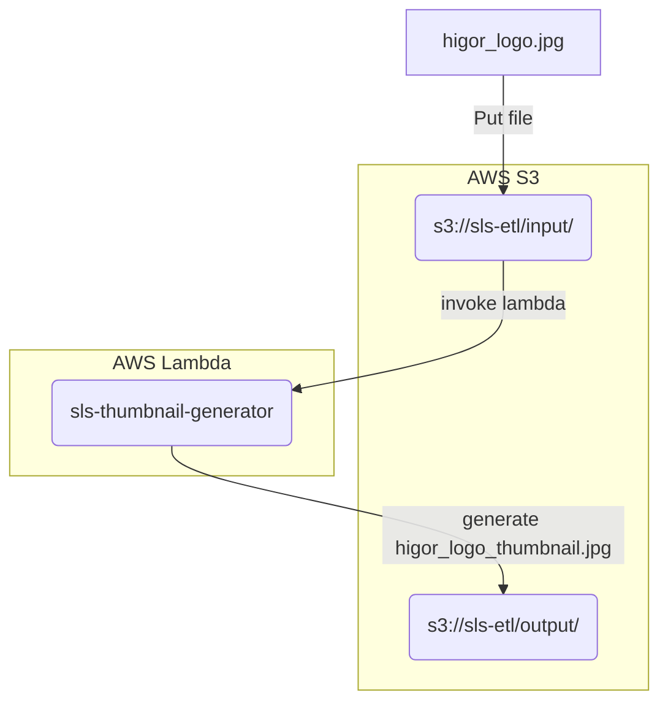

# Thumbnail Generator

Description: Generate a Thumbnail image in `128x128` using AWS Lambda with S3 events.

Technologies:
- Python
- Serverless Framework in AWS

**Architecture description**




## Serverless installation

```Bash
# Install serverless
npm install -g serverless
```

## Deploy to prod and ussage

```Bash
# Deploy
sls deploy

# Put image in S3
aws s3 cp ./static/higor_logo.jpg s3://sls-etl/input/
```

## Clean

```Bash
# Delete files in S3
aws s3 rm s3://sls-etl/output/higor_logo_thumbnail.jpg \
&& aws s3 rm s3://sls-etl/input/higor_logo.jpg \
&& sls remove --verbose
```

## Optimize time and billing

- Use multiple AWS Lambdas depending with different memory allocation. Not make sense to use a lambda with 5 GB RAM to process an image with 10 MB.
- Remplace Pillow for another library to generate thumbnail images.
